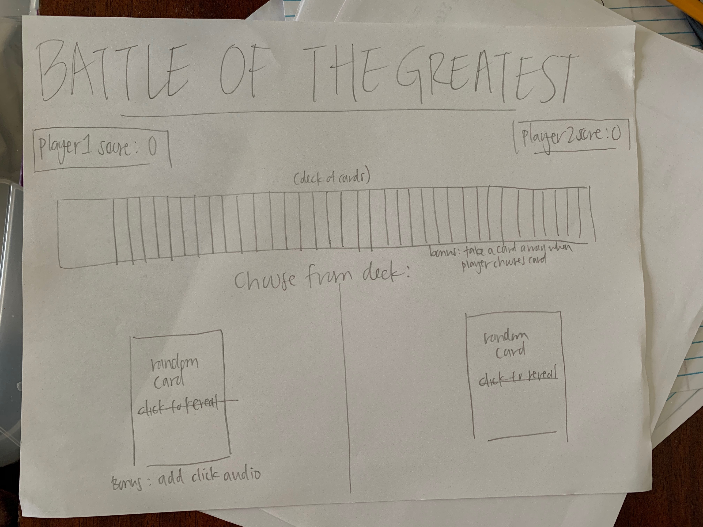
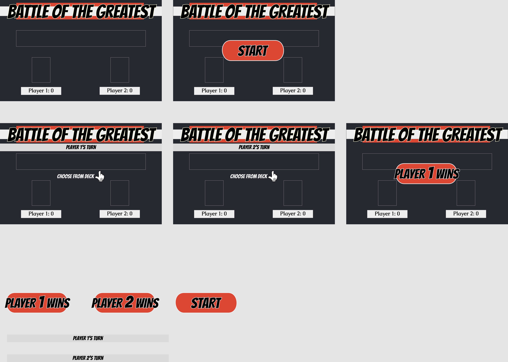
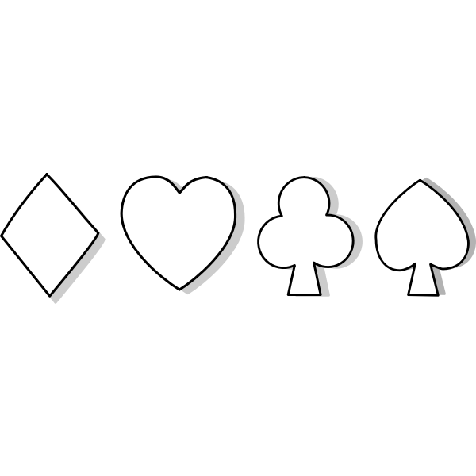

# project-zero

## Overview 
---
Battle of the Greatest is dependent on the luck of draw. Two players will compete against each other to see who chooses the bigger card. 

## Wireframe
---

## Instructions
---

- Whoever gets to 5 points first wins. Winner gets 1 point each round.

## Instruction tab:
---
    

    - showing suits from smallest to biggest
    (diamonf, clover, heart, spade)

    - showing card number smallest to biggest
    (3-10 J, Q, K, A, 2)

## User story:
---
- User clicks "start/choose a card button" to begin
    - button disappears when it's been clicked
    - **BONUS:** click sound

- User chooses a random card from deck. Computer will randomize a card for user if user doesn't pick within 10 seconds
    - **BONUS:** layout cards + shuffle sound (first round)

- Card is revealed on user's side (enlarged)
    - **BONUS:** card slides over (revealed)

- Computer's turn to choose a card (randomize)

- Compare both cards to see which card is bigger
    - **DIFFICULTY:** comparing suits

- alert('User wins')
    - score += 1

- After a player reaches 5 points, there will be another alert pop up or have a button pop up to annouce winner:
    - alert('User is the winner!')